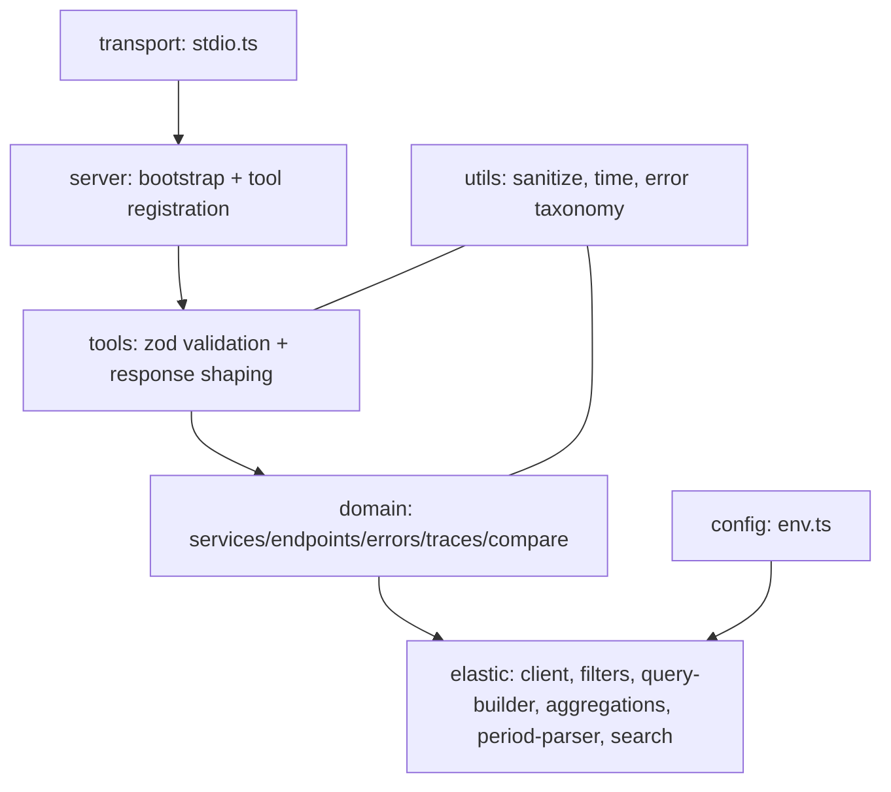

# Design — elk-observability-mcp

This document records the architecture decisions already made during
exploration, as the chosen approach (not as options being weighed).

## 1. Module dependency direction

```
transport/ (stdio.ts, later http.ts/sse.ts)
      |
      v
server/  (MCP server bootstrap, tool registration — transport-agnostic)
      |
      v
tools/   (one file per tool: zod input validation -> domain call -> response shaping/sanitization)
      |
      v
domain/  (services, endpoints, errors, traces, compare — ES-facing business logic,
          transport-agnostic, testable via an injected fake SearchClient)
      |
      v
elastic/ (client, filters, query-builder/QuerySpec compiler, aggregations,
          period-parser, search wrapper with error mapping)
```

Dependencies only ever point downward. `domain/` never imports from
`tools/`, `server/`, or `transport/`. `elastic/` never imports from
`domain/` or above. This is what allows stdio to be swapped/extended with
HTTP/SSE later (FR-23) without touching `domain/` or `tools/`.



## 2. Query composition — `QuerySpec` + `compileFilters`

**Decision:** a declarative, plain-object `QuerySpec`:

```ts
interface QuerySpec {
  service?: string;
  environment?: string;
  processorEvent?: "transaction" | "span";
  transactionName?: string;
  httpMethod?: string;
  includeOptions?: boolean;
  period?: string;       // pre-validated period expression
  traceId?: string;
}
```

is passed to a single pure function `compileFilters(spec: QuerySpec):
QueryDslQueryContainer[]`, itself composed from small pure per-dimension
filter functions (one each for `service.name`, `service.environment`,
`processor.event`, `transaction.name`, `http.request.method`,
`@timestamp` range, `trace.id`, and the OPTIONS-exclusion clause). Each
filter function inspects only its own key on `spec` and returns either a
filter clause or nothing.

**Rationale:** this was chosen over a fluent builder because it gives the
strongest structural guarantee for the two highest-risk cross-cutting
constraints:

- FR-14 (never default `environment`): a `spec` object simply omitting the
  `environment` key makes it structurally impossible for the compiler to
  emit an environment clause — there is no code path where "key absent"
  could be silently treated as "key present with a default value," because
  the per-dimension filter function for `environment` only ever reads
  `spec.environment` and returns nothing when it is `undefined`.
- FR-1 (never hardcode a service): `service` is always a caller-supplied
  string flowing straight into a `term` filter; no enum, switch, or
  suffix-based classification exists anywhere in the compiler.

A secondary benefit: every dimension is independently unit-testable in
isolation, e.g. "a spec without an `environment` key produces a filter
array containing zero environment clauses" is a single direct assertion,
with no fluent-builder call-order to also verify.

## 3. Percentile / aggregation queries

**Decision:** all aggregate-shaped tools (`list_services`, `list_endpoints`,
`get_service_health`, `get_endpoint_health`, `get_endpoint_latency`,
`get_slow_services`, `get_slow_endpoints`, `compare_periods`) issue
`size: 0` (aggregation-only) searches with `bool.filter` built from
`compileFilters(spec)`, plus:

- a `terms` aggregation on `transaction.name` (endpoint-level tools) or
  `service.name` (service-level tools), and
- sub-aggregations: `percentiles` (percents: `[50, 75, 90, 95, 99]`), `avg`,
  and `max` on `transaction.duration.us` (or `span.duration.us` where a
  span-level metric is needed), plus a plain `value_count`/`doc_count` for
  request totals.

All percentile/avg/max values returned by Elasticsearch are in
microseconds and are converted to milliseconds (`us / 1000`) at the
`utils/time.ts` boundary before being placed into any response field, and
every converted field is named with an explicit `_ms` suffix (FR-16) — this
conversion never happens inside `elastic/` or `domain/` ad hoc; it is a
single shared utility so there is exactly one place where the unit
conversion could go wrong.

**Rationale for TDigest disclosure:** Elasticsearch's `percentiles`
aggregation uses the TDigest algorithm, which is an approximation, not an
exact percentile. This is disclosed in specification.md and design docs as
an inherent property of the tool, not a defect to fix — no client-side
"exact percentile" recomputation is attempted (fetching raw docs to compute
exact percentiles would violate the response-bounding constraint, FR-20,
at any meaningful traffic volume).

## 4. Trace reconstruction (`trace_request`, `get_trace_dependencies`)

**Decision:**

1. Issue a `term` query on `trace.id` against `APM_TRACE_INDEX`, size-capped
   (e.g. `500`) to bound worst-case response size even for unusually large
   traces.
2. Split the result set by `processor.event`: exactly one `"transaction"`
   document is expected (if more than one is returned, the first
   chronologically is used and this is treated as a data anomaly, not an
   error); the remainder with `processor.event: "span"` are spans.
3. Link spans to their parent transaction via `transaction.id` (present on
   both the transaction document as `transaction.id` and on span documents
   as `transaction.id`) — not via `parent.id`/`span.id`, because the sample
   span shape provided does not include those fields (Open Risk #4). No
   deeper nested call-tree (span-to-span parent/child) is attempted in
   v0.1; grouping stays at the transaction/span level.
4. Order all documents (transaction + spans) by `@timestamp` ascending to
   produce the chronological `spans` array in `trace_request`.
5. For `get_trace_dependencies`: group spans by the composite key
   `(span.type, span.subtype, destination.address)`, sum `span.duration.us`
   per group, convert to milliseconds, and compute
   `percentage_of_trace = group_total_ms / transaction_duration_ms * 100`.
   This value is returned uncapped — the concurrency caveat (Open Risk #5)
   is surfaced as an always-present `caveat` field in the response rather
   than a conditional warning, so consumers never have to guess whether the
   caveat applies to their particular result. When `transaction_duration_ms`
   is `0` (no `transaction` document found among the trace's documents — a
   data anomaly distinct from "no documents at all", which already raises
   `TRACE_NOT_FOUND`), `percentage_of_trace` is `null` rather than
   `Infinity`/`NaN`, so the field's type is `number | null`.

## 5. Error-field tolerance strategy (`get_top_errors`)

**Decision:** because `APM_ERROR_INDEX` field names are unverified against
this cluster's real mappings (Open Risk #1), grouping does not hardcode one
field path. Instead, a shared helper:

```ts
function getFirstDefined(doc: unknown, candidatePaths: string[]): unknown
```

walks an ordered list of candidate dot-paths per document and returns the
first one present. For error grouping, the candidate order is:

1. `error.grouping_key` (the standard APM field for this purpose)
2. `error.exception.type`

This ordering is a best-effort default, not a verified fact; the first
integration task once real Elasticsearch credentials exist must run a real
`_mapping` inspection of `APM_ERROR_INDEX` and adjust the candidate list if
needed (recorded as a task in tasks.md, not resolved here).

## 6. Folder structure

```
src/
├── server/            # MCP server bootstrap, tool registration (transport-agnostic)
├── transport/         # stdio.ts now; http.ts/sse.ts later
├── elastic/           # client.ts, filters.ts, query-builder.ts (QuerySpec+compiler),
│                       # aggregations.ts, period-parser.ts, search.ts (error-mapped wrapper)
├── domain/             # services.ts, endpoints.ts, errors.ts, traces.ts, compare.ts
│                       # — ES-facing business logic, transport-agnostic, testable via
│                       #   injected fake client
├── tools/              # one file per MCP tool: zod validation + domain call +
│                       #   response shaping/sanitization
├── schemas/            # zod input/output schemas per tool
├── utils/               # sanitize.ts, time.ts (us->ms), errors.ts (typed taxonomy)
└── config/              # env.ts — loads/validates ELASTICSEARCH_URL, API key, index
                          #   name env vars
```

This refines the originally suggested `src/{elastic,tools,schemas,utils}`
by splitting out `server/`, `transport/`, and `domain/` explicitly, so that
(a) transport concerns never leak into tool logic, and (b) business logic
in `domain/` can be unit-tested against a fake client without ever touching
the real `@elastic/elasticsearch` client or `zod` validation layer.

## 7. Testing strategy

**Decision:** Vitest, Strict TDD. Dependency injection of a narrow
`SearchClient` interface (not `vi.mock('@elastic/elasticsearch')`), so that
every `domain/*` function accepts an injected client:

```ts
interface SearchClient {
  search<T>(request: SearchRequest): Promise<SearchResponse<T>>;
}
```

Tests exercise `domain/*` against a fake implementation of this interface,
backed by fixtures under `test/fixtures/*.json` mirroring the real
transaction/span document shapes supplied by the user (including the
verb-less transaction name case, the mssql span case, and a case with no
`environment` field at all).

Independently TDD-able units, in build order:

1. `period-parser` — valid formats (`15m,30m,1h,2h,6h,12h,24h,7d`) and
   strict rejection of anything else, including adversarial/injection-style
   strings (security-relevant per FR-17).
2. `filters` / `query-builder` — each per-dimension filter function in
   isolation, then `compileFilters` as a whole; an explicit test asserting
   "no `environment` key on the spec -> zero environment clauses in the
   compiled filter array" (FR-14).
3. Aggregation-shape assertions — that the aggregation request built for a
   given `QuerySpec` has the expected `terms`/`percentiles`/`avg`/`max`
   sub-aggregation structure.
4. `utils/time.ts` — microsecond-to-millisecond conversion and the explicit
   `_ms` field-naming convention.
5. OPTIONS handling — default-exclude behavior vs. `include_options: true`
   override, case-insensitive method matching.
6. `sanitizeDocument()` — default-off disclosure of sensitive fields,
   configurable extra sensitive-field list, and that API keys are never
   present in any code path's output including error/debug output.
7. Error-mapping — Elasticsearch client errors (401/403/404/timeout/other)
   mapped to the exact typed taxonomy codes from specification.md, with no
   raw stack trace present outside `DEBUG=true`.
8. Domain logic per capability group (`services`/`endpoints`,
   `health`/`latency`, `errors`, `traces`/`dependencies`, `compare`)
   against the fixture-backed fake `SearchClient`.
9. Zod schema boundary tests per tool — `limit <= 100` enforcement,
   tool-specific defaults, required-vs-optional parameter enforcement.

Integration tests are gated behind presence of both `ELASTICSEARCH_URL` and
`ELASTICSEARCH_API_KEY` using `describe.skipIf(...)`, and cover: real
authentication, real aggregation response-shape sanity, a real `_mapping`
inspection of `APM_ERROR_INDEX` (to resolve Open Risk #1), and real
`INDEX_NOT_FOUND` behavior against a deliberately misconfigured index name.

**Commands:** `npm test` -> `vitest run`; watch mode -> `vitest`; coverage
-> `vitest run --coverage`.

## 8. Other deliverables accounted for (implementation, not this doc set)

- `.env.example` — contents specified in `specification.md`.
- `Dockerfile` + `.dockerignore` — multi-stage build, non-root runtime user,
  production dependencies only in the final image, `ENTRYPOINT` running the
  stdio server.
- `README.md` — architecture overview, configuration reference, install/run
  instructions, Claude Code/Claude Desktop MCP client configuration
  snippet, full tools/params/examples reference (mirrors
  specification.md), security notes (read-only guarantee, sanitization
  defaults, no API keys in logs), Docker usage, and troubleshooting.

These are scheduled as concrete checklist items in `tasks.md`, not
designed further here.
